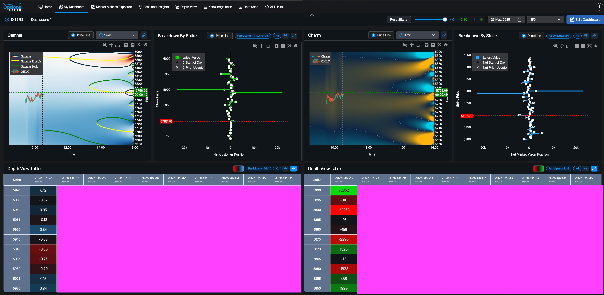

https://x.com/mugzyjones/status/1926034793981993412

aigonewrong — 5/23/25, 7:39 AM
the latest (2025-05-23) positive state GEX for SPX 5890, 5900 is interesting.
Unusualwhales data shows one is near bid and one is near ask
Gexbot state shows both GEX is positive. who is right? haha. 🙂
https://unusualwhales.com/flow/option_chains?chain=SPXW250523C05890000&intraday_only=true
https://unusualwhales.com/flow/option_chains?chain=SPXW250523C05900000&intraday_only=true

johnkirby — 5/23/25, 7:46 AM
Both. Bc we are monitoring the impact of transactions on prices and spreads what our classification reflects is that from the perspective of the vol surface, they were both "buys" even if a spread was technically transacted
basically, the surface got lifted there. From our perpective this is what is more important in terms of understanding the systemic impact 

johnkirby — 5/23/25, 7:47 AM
Impact of transactions on the tape is more important than what htose transactions technically "were"
for sure dude

johnkirby — 5/23/25, 7:48 AM
yes, but they are also placing a ceiling on us
so bullish but vol dampening
i played the open and this stuff in state futs

--

https://x.com/hauvolatility/status/1369330081999556616

https://x.com/VolSignals/status/1773882497530561003

# 2025-03-31 https://x.com/OptionsDepth/status/1906733192616214751/photo/1
# 2025-05-08 https://x.com/OptionsDepth/status/1920512128852586718/photo/1
# "The Pitfalls of Open Interest_ Unlocking True Market Positions.pdf"
# https://spotgamma.com/the-anatomy-of-an-spx-0dte-driven-market/